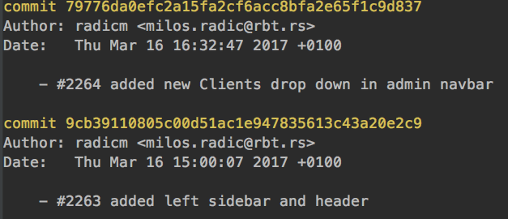
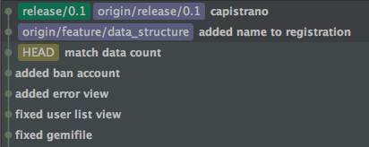
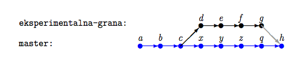
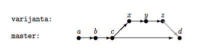
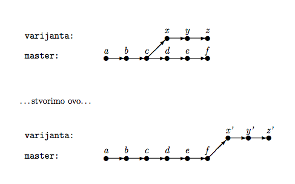
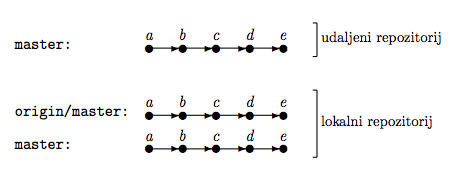
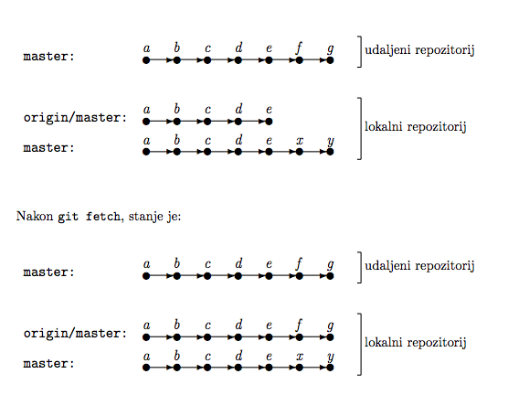
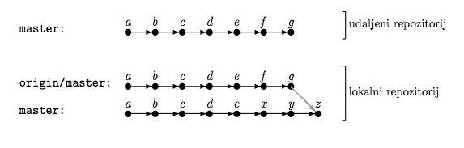
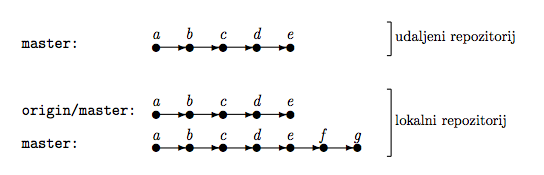
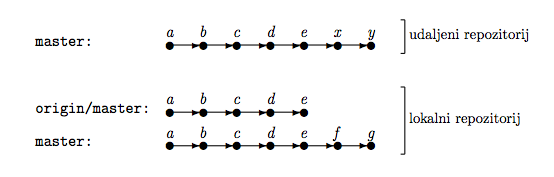

#HSLIDE
### Sistemi za verzionisanje (VCS)

#HSLIDE

### Sta su sistemi za verzionisanje programa / koda?

Alati koji nam omogucavaju vodnjenje evidnecije izmenama nad projektom bilo da radimo sami ili u grupi. 

#HSLIDE

### Koji sve tipovi sistema postoje?
 Lokalni | Centralizovani | Distribuirani


#HSLIDE
### Uvod u Git


#HSLIDE
###Zasto git?
Jer se u odnosu na druge istakao svojom brzinom, integritetom nad podatcima, distribuiranoscu i mogucnoscu za ne linearnim tokom rada.

#HSLIDE
###Git VS SVN


#HSLIDE
###Kako je zamisljen?
Kao mreza zasebnih repozitorijuma koji se mogu medjusobno sinhronizovati (distribuiranost), iz toga proistice da svaka izmena koja je napravljena utice samo na lokalni repozitorijum sve dok se ne izvrsi sinhronizacija sa drugim repozitorijumom.

#HSLIDE
###Kako se najcesce koristi?
Kao kombinaciju centralizovane i distribuirane mreze gde se sve izmene sinhronizuju preko jednog udaljenog repozitoriujma (Github, Bitbcuket, Gitlab...)git a

#HSLIDE
### Repozitoriujum
Mesto na kome se cuvaju svi commit-ovi sa promenama koje smo do napravil. Moze biti lokalni ili udaljeni. Nalazi se u nasem projektu u `.git` dorektorijumu.

#HSLIDE
### Commit

Commit predstavlja stanje projekta u odredjenom trenutku kada samo ga nacinilo. Vise povezanih commit-ova formira graf koji predstavlja istoriju naseg projekta.

#HSLIDE
### Dobra praksa  

Commit-ove treba cesto praviti, gde svaki od njih predstavlja jednu ideju ili promenu koja je jednostavna za citanje i laka za naknadno uklanjanje

#HSLIDE
### Linerano istorija koda

Idealna situacija u kojoj su se izmene desavale sekvencialno jedna za drugom. Projekat je zapocet sa stanjem a, pa se napravljene izmjene b, c, . . . sve do prve verzije.U ovo me nam dosta pomaze rebase koji cemo kasnije spomenuti.


#HSLIDE
### Grafovi i grananje

Grananje predstavlja nelinearno verzionisanje i ono se moze predstaviti pitem grafova


#HSLIDE
### Prakticni rad


#HSLIDE

###Rukovanje

```
# command
git <command> <option 1> <option 2> …

# help
git help <command> …
```

#HSLIDE
###Inicializacija repozitoriuma

```
# inicializacija novog repozitorijuma
$ cd <repo name>
$ git init

# kloniranje postojeceg udaljenog repozitorijuma
$ git clone <https link> or <ssh link>
$ cd <repo name>
```

#HSLIDE
###Konfiguracija

globalna | lokalna | sistemska

```
git config --global
git config config user.name
git config user.email 
...
```

#HSLIDE
###.gitignore

Datoteka u kojoj su navedeni svi direktorijumi i datotoeke koje zelimo da izuzmeo iz verzionisanja (.idea, /log, /*.yml...)

#HSLIDE
###Index i commit
Mesto gde se pripremaju izmene za commit


#HSLIDE
```
# dodavanje datoteke u pracanje
$ git add <name>
# prikazivanje trenutnog statusa
$ git status
# prvi commit
$ git commit -m 'Prva izmena'
$ git status
# kaci promene na predhodni commit
$ git commit -amend
```

#HSLIDE
### Stash
Mesto za privremeno cuvanje izmena

```
# stash sa dafault imenom
$ git stash
# stash sa specificiranim imenom
$ git stash <-u> <save [name]>
# izlistavanje svih stash-eva
$ git stash list
```

#HSLIDE
### Uklanjanje promena iz indexa

```
# Ukloni iz repozitorijuma ali ostavi fizicki
$ git rm --cached <name> 
# Ukloni sve izmene od poslednjeg commit-a
$ git checkout . or <name>
```

#HSLIDE
### Uklanjanje commit-a

```
# obrisi sve commit-ove i njihove promene
$ git reset <commit sha> --hard
# obrisi sve commit-ove ali ostavi njihove izmene u indexu
$ git reset <commit sha> --soft
# obrisi sve commit-ove ali ostavlji izmene u radnom direktorijumu
$ git reset <commit sha> --mixed
# kreira novi commit sa spuprotnim promenama
$ git revert
```

#HSLIDE
### Istorija projekta

```
# prikazivanje istorije
$ git log
# formatiran instorija
$ git log --graph --all --oneline --decorate
```



#HSLIDE
### Kretanje kroz commitove

```
git log
git checkout <commit sha> or <tag> or <branch>
git checkout HEAD~5
```

#HSLIDE
### HEAD
Referenca na 'trenutni' SHA1 commit-a na kome se nalazimo



#HSLIDE
### Detached HEAD
Bilo koji checkout na commit koji nije ime grane dovodi do ovog stanja, cak i na SHA1 koji je poslednji na grani (ovo stanje se moze predstaviti kao anonimna grana). Samo checkout na ime lokalne grane izbegava ovo stanje.

```
# resenje za deached HEAD
git checkout develop
```

#HSLIDE
### grananje

```
$git branch
$git branch <name>
$git checkout -b <name>
```
#HSLIDE



```
# experiment grana u sadasnju granu
$git merge develop (fast forvard)
```


#HSLIDE


```
# varijanta u sadasnju granu
git merge varijanta
```


#HSLIDE


```
# varijanta u na vrh sadasnje granu
git rebase varijanta
```

#HSLIDE
### Cherry pick

Preuzima bilo koji commit i primenjuje ga gde god da se trenutno nalazimo, kao rezulat nasanjenovi commit sa istim izmenama i drugim SHA id-em.

```
# preuzmi ceo commit
$ git cherry-pich <sha>
# preuzmi deo commit-a
$ git cherry-pick -n (--no-commit) <sha>
```

#HSLIDE
### Conflict
Nastaju kada git neume sam da razresi dve promene koje su se desila na istoj liniji koda. Tada se od korisnika zahteva da otvori datoteku i rucno da obrise visak izmena i izvrsi commit

```
<<<<<<< HEAD
open an issue
=======
ask your question in IRC.
>>>>>>> branch-a

git add <conflict file>
git commit
```

#HSLIDE
### Udaljeni repozitorijum


#HSLIDE
### Dodavanje udaljenog repozitorijuma 

```
# Dodavanje novog udaljenog repozitorujma
git remote add origin https://github.com/user/repo.git

# Validacija udaljenog repozitorijuma
git remote -v
origin  https://github.com/user/repo.git (fetch)
origin  https://github.com/user/repo.git (push)
```

#HSLIDE
### Ispod haube


#HSLIDE
### Preuzimanje izmena
#### fetch <br>



```
$ git fetch <remote repo> <branch>
```


#HSLIDE
#### pull <br>



```
$ git fetch
$ git merge origin/master
# isto sto i
$ git pull origin master
```

#HSLIDE
#### pull rebase<br>


```
$git pull rebase
```

#HSLIDE
### Slanje izmena



```
$ git push <remote repo> <branch>
$ git push origin master
```

#HSLIDE
Situacija u kojoj smo u nasem master commit-ovali, ali jos neko je poslao pre nas izmene na udaljeni master



```
$ git push
error: failed to push some refs to remote

$ git pull
$ git push
```

#HSLIDE
### Uklanjanje commit-ova iz udaljenog repozitorijuma
Vrsi se tako sto se napravi novi commit sa izmenama koje negiraju predhodno poslate

```
# kreira novi commit
$ git revert
# salje izmene na udaljeni repozitorijum 
$ git push
# brise lokalni commit
$ git reset <sha> --hard
# nasilno prepisuje istoriju udaljenog repozitorijuma
$ git push <branch> -f
```

