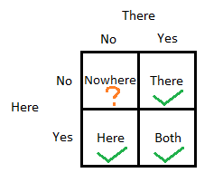
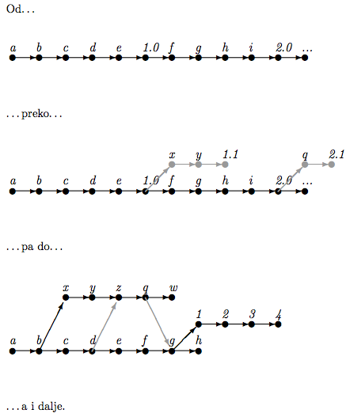
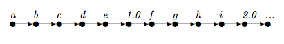
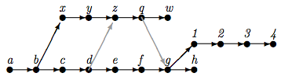
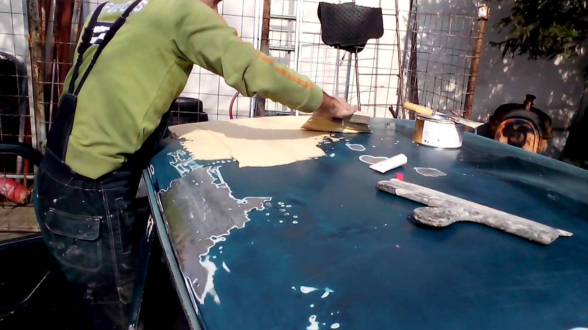

#HSLIDE
### Sistemi za verzionisanje (VCS)

#HSLIDE

### Sta su sistemi za verzionisanje programa / koda?

Alati koji nam omogucavaju vodnjenje evidnecije izmenama nad projektom bilo da radimo sami ili u grupi. 

#HSLIDE

### Koji sve tipovi sistema postoje?
 Lokalni | Centralizovani | Distribuirani



#HSLIDE
### Uvod u Git


#HSLIDE

###Zasto git?
Jer se u odnosu na druge istakao svojom brzinom, integritetom nad podatcima, distribuiranoscu i mogucnoscu za ne linearnim tokom rada.

#HSLIDE
###Kako je zamisljen?
Kao mreza zasebnih repozitorijuma koji se mogu medjusobno sinhronizovati (distribuiranost), iz toga proistice da svaka izmena koja je napravljena utice samo na lokalni repozitorijum sve dok se ne izvrsi sinhronizacija sa drugim repozitorijumom.

#HSLIDE
###Kako se najcesce koristi?
Kao kombinaciju centralizovane i distribuirane mreze gde se sve izmene sinhronizuju preko jednog udaljenog repozitoriujma (Github, Bitbcuket, Gitlab...)

#HSLIDE
### Repozitoriujum
Mesto na kome se cuvaju svi commit-ovi sa promenama koje smo do napravil. Moze biti lokalni ili udaljeni. Nalazi se u nasem projektu u `.git` dorektorijumu.

#HSLIDE
### Commit

Commit predstavlja stanje projekta u odredjenom trenutku kada samo ga nacinilo. Vise povezanih commit-ova formira graf koji predstavlja istoriju naseg projekta.

#HSLIDE
### Dobra praksa  

Commit-ove treba cesto praviti, gde svaki od njih predstavlja jednu ideju ili promenu koja je jednostavna za citanje i laka za naknadno uklanjanje

#HSLIDE
### Linerano istorija koda

Idealna situacija u kojoj su se izmene desavale sekvencialno jedna za drugom. Projekat je zapocet sa stanjem a, pa se napravljene izmjene b, c, . . . sve do prve verzije.U ovo me nam dosta pomaze rebase koji cemo kasnije spomenuti.



#HSLIDE
### Grafovi, grananje i spajanje grana

TODO fix Nelinearno verzionisanje koda je zgodan pristup koji nam omogucava podelu tok razvoja na vise paralelnih grana gde bi se u svakoj razvijala tacno odredjena stvar bez remecenja 



#HSLIDE
### Prakticni rad


#HSLIDE

###Rukovanje

```
# command
git <command> <option 1> <option 2> …

# help
git help <command> …
```

#HSLIDE
###Inicializacija repozitoriuma

```
# inicializacija novog repozitorijuma
$ cd <repo name>
$ git init

# kloniranje postojeceg repozitorijuma
$ git clone <https link> or <ssh link>
$ cd <repo name>
```

#HSLIDE
###Konfiguracija

globalna | lokalna | sistemska

```
git config --global
git config config user.name
git config user.email 
...
```

#HSLIDE
###.gitignore

Datoteka u kojoj su navedeni svi direktorijumi i datotoeke koje zelimo da izuzmeo iz verzionisanja (.idea, /log, /*.yml...)

#HSLIDE
###Index i prvi commit
Mesto gde se pripremaju izmene za commit


#HSLIDE
```
# dodavanje datoteke u pracanje
$ git add <name>
# prikazivanje trenutnog statusa
$ git status
# prvi commit
$ git commit -m 'Prva izmena'
$ git status
# prikazivanje istorije projekta
$ git log
# formatiran prikaz
$ git log --graph --all --oneline --decorate
```

#HSLIDE
### HEAD
Referenca na 'trenutni' SHA1 commit-a na kome se nalazimo

#HSLIDE
### Detached HEAD
Bilo koji checkout na commit koji nije ime grane dovodi do ovog stanja, cak i na SHA1 koji je poslednji na grani (ovo se moze predstaviti kao anonimna grana). Samo checkout na ime lokalne grane izbegava ovaj slicaj.

```
# fix for deached HEAD
git checkout develop
```

#HSLIDE
### Kretanje kroz istoriju

```
git log
git checkout <commit sha> or <tag>
```

#HSLIDE
### Stash
Mesto za privremeno cuvanje izmena

```
# stash sa dafault imenom
$ git stash
# stash sa specificiranim imenom
$ git stash <-u> <save [name]>
# izlistavanje svih stash-eva
$ git stash list
```

#HSLIDE
### Uklanjanje promena iz indexa

```
# obrisi datoteku
$ git rm <name> 
# Ukloni iz repozitorijuma ali ostavi fizicki
$ git rm --cached <name> 
# Ukloni sve izmene od poslednjeg commit-a
$ git checkout . or <name>
```

#HSLIDE
### Uklanjanje commit-ova iz lokalnog repozitorijuma

```
# obrisi sve commit-ove i njihove promene
$ git reset --hard <commit sha> 
# obrisi sve commit-ove ali ostavi njihove izmene u indexu
$ git reset --soft <commit sha>
```

#HSLIDE
### Uklanjanje commit-ova iz udaljenog repozitorijuma

```
# obrisi sve commit-ove i njihove promene
$ git reset --hard <commit sha> 
# obrisi sve commit-ove ali ostavi njihove izmene u indexu
$ git reset --soft <commit sha>
```


