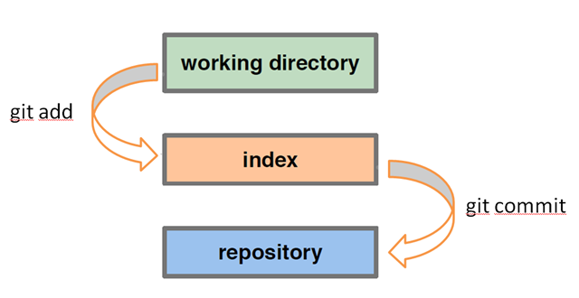

#HSLIDE
### Version Control Systems (VCS)

#HSLIDE

###What are Version Control Systems?

Version control systems are a category of software tools that help a software team manage changes to source code over time. Version control software keeps track of every modification to the code in a special kind of database. If a mistake is made, developers can turn back the clock and compare earlier versions of the code to help fix the mistake while minimizing disruption to all team members.

#HSLIDE

###VCS types?
 Local | Centralized | Deentralized

#HSLIDE
### Git intro

#HSLIDE
###Why git?
- faster
- data integrity
- distributed 
- nelinear history

#HSLIDE
###Initial idea?
Network of distributed repositories which can synhronize with each other (origin of distribution). Thats the reason why every change is local until you push it to remote repo.

#HSLIDE
###Git VS SVN

#HSLIDE
###How is mostly used?
Combination of distributed and centralized network where every developer has his local repo but he when he want to synhronize his work with team he does that over central repo (Github, Bitbcuket, Gitlab...)

#HSLIDE
###Repository
Place where all commits and changes are saved. It can be _local_ or _remote_. Local repo is located in our project in `.git` directory. 

#HSLIDE
###Commit

Saved state of project in certain time. Multiple linked commits form graph which represent history of project.

#HSLIDE
###Index
Place where you prepare your changes for commit

#HSLIDE
###Best practice

- Commit early, commit often. 
- One commit represents: 
	- one idea or one change 
	- makes it easy to read 
	- patches easy to revert unwanted changes later

#HSLIDE
###HEAD  
HEAD represent pointer to one commit, usualy its latest commit on branch, but if you itereate trough history it cam be any previous commit.

#HSLIDE
###Linear history

Ideal situtation where every changes are created one by one in row. Project started with change, `a` then changes `b`, `c`, . . . ocured and finaly version 1.0 is created. `Rebase` command is very helpful for this kind of job.

#HSLIDE
###Branching

Branching is a part of nelinear versiong and it is visualy represented using graphs.

#HSLIDE
###Remote repository

#HSLIDE
###.gitignore

Specific file where write all files and folders which you don't want to be tracked (.idea, /log, /*.yml...)

#HSLIDE
### Workshop
