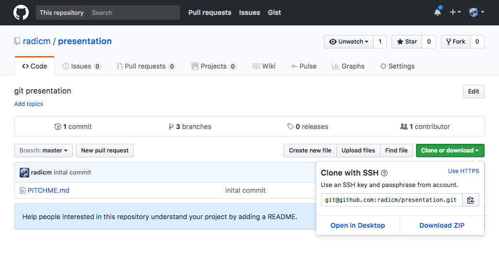

###Instalacija i priprema
Win

`https://git-scm.com/download/win`

Linux (Ubuntu)

`sudo apt-get install git`

OSX

`brew install git`

Win

```
# kreaira direktorijum
$ md git-workshop

# pozicionira se u njega
$ cd git workshop
```

Unix/Linux

```
# kreairaj direktorijum
$ mkdir git-workshop

# pozicioniraj se u njega
$ cd git workshop
```

###Git iz terminala

```
# zadavnje komandi
git <command> <option 1> <option 2> …

# pomoć
git help <command> …
```

###Inicializacija repozitorujma

```
# u projektu
$ git init
```

###Konfiguracija (globalna | lokalna | sistemska)

```
git config --global
git config config user.name <user-name>
git config user.email <user-email>
```

###Commit

```
# kreira novi fajl
touch enter.txt
```

Otvoriti enter.txt u text editoru (notepad...) i unesti:

```
Enter git workshop
```


```
# dodavanje datoteke u index
$ git add enter.txt

# prikazivanje trenutnog statusa i izmena
$ git status

# prvi commit
$ git commit -m 'Prva izmena'

# nema izmena
$ git status
```

###Pregled istorije

```
# prikazuje dosadanje commitov-e
$ git log
```

###Resetovanje promena

Uneti text u enter.txt

```
Enter git workshop
Line 1
Line 2
Greska
```

Cuvanje izmena

``` 
$ git add enter.txt

# drugi commit
$ git commit -m 'Pogresna izmena'

# lista istoriju gde se vidi pogresan commit
$ git log

# brise pogresan commit
$ git reset --hard <commit-id>
```

###Sakrivanje promena

Uneti text u enter.txt

```
Enter git workshop
Line 1
Line 2
Line 3
```

``` 
# prikazuje trenutne izmene
$ git status

# privremeno sklanja izmene
$ git stash 

# nema izmena
$ git status

# vraca sklonjene izmene
$ git stash pop

# ponovo vidimo izmene
$ git status
```

###Grananje

```
# lista sve grane
git branch 

# pravi novu granu
git branch enter

# pozicionira se na novu granu
git checkout enter
```
Promeniti enter.txt u:

```
Enter git workshop
Line 1
Line 2
Line 3
```

Sacuvati izmene

``` 
$ git add enter.txt

# drugi commit
$ git commit -m 'Enter izmena'
```

Spajanje izmena nazad

```
Pozicionira se na master
git checkout master

spaja enter u master granu
git merge enter
```

###Konflikt

```
$ git checkout enter 
$ touch conflict.txt
# uneti izmene

$ git add conflict.txt
$ git commit -m 'Enter new file'
```
conflict.txt [enter grana]
```
Lorem ipsum dolor sit amet, consectetur adipiscing elit. Duis sed libero nulla. Vestibulum id velit eu enim aliquet posuere.
```

```
git checkout master
$ touch conflict.txt
# uneti izmene

$ git add conflict.txt
$ git commit -m 'Master new file'
```

conflict.txt [master grana]
```
Lorem ipsum dolor sit samet, consectetur adipiscing elit. Duis sed libero nulla. Vetibulum id velit eu enim aliquet posuere.

Lorem ipsum dolor
```

```
$ git merge enter
Auto-merging conflict.txt
CONFLICT (content): Merge conflict in conflict.txt
Automatic merge failed; fix conflicts and then commit the result.
```

Otvoriti editor i resiti konflikt

pre

```
TODO
```

posle

```
Lorem ipsum dolor sit samet, consectetur adipiscing elit. Duis sed libero nulla. Vetibulum id velit eu enim aliquet posuere.

Lorem ipsum dolor
```

```
git add conflict.txt
git commit
```

###Slanje izmena na github

Kreirajte nalog na Github-u - https://github.com/ 
Napravite novi repozitorijum https://github.com/new



```
# postavlja udaljeni repozitirijum
git remote add origin remote repository URL

# lista udaljene repozitorijume
git remote -v

# salje nove grane na udaljeni repozitorijum
git push -u origin master

# slanje izmen
git push

# povlacenej izmena
git pull
```

###GUI za git

Win

* Source tree
* Tortoise

Linux

* TODO

OSX

* Source tree


