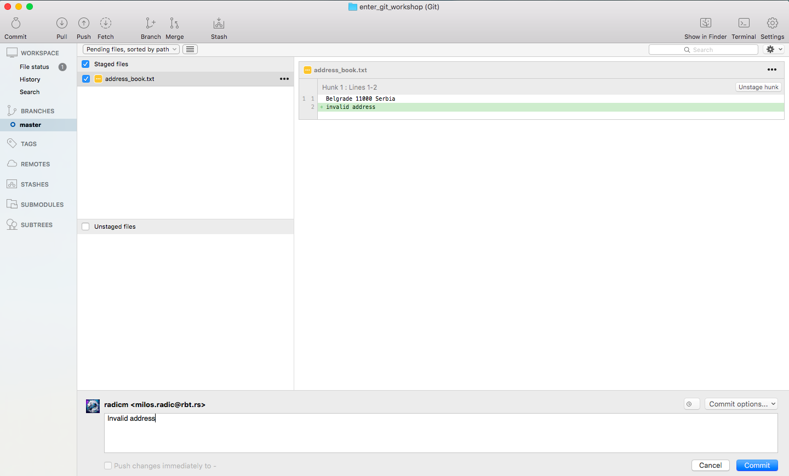
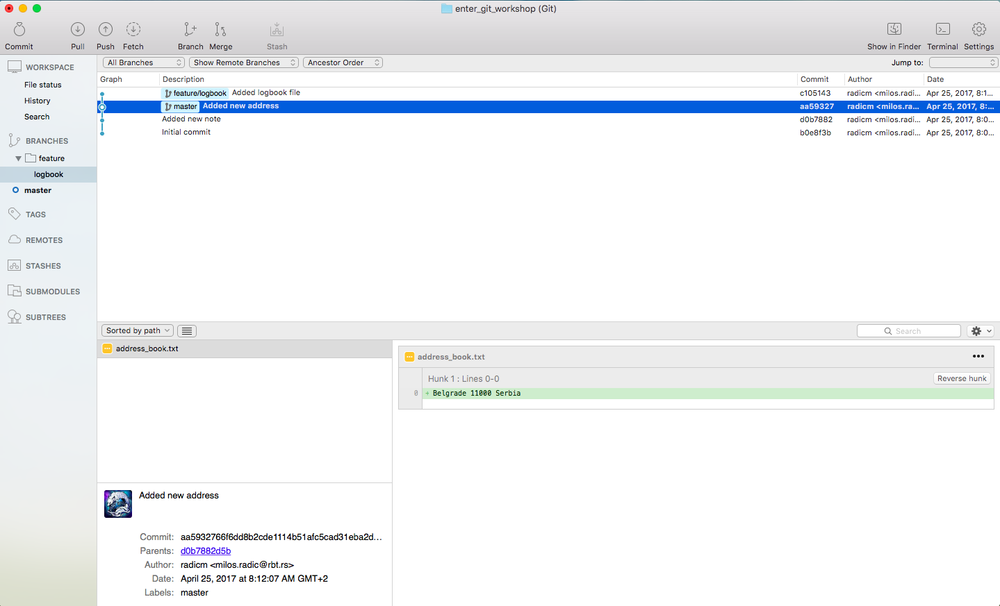

#Git workshop 

----

#GIT Installation and setup

__Win__

`https://git-scm.com/download/win`

__Linux (Ubuntu)__

`sudo apt-get install git`

__OSX__

`https://git-scm.com/download/mac`

#UI Client

In this tutorial we will use Source Tree Git UI client, its available for Mac and Win.

```
https://www.sourcetreeapp.com/
```

Beside Source Tree for win you can use Tortoise.

```
https://tortoisegit.org/
```

#Project setup

Before we start using git we should create our working (project) direcory. Create `enter_git_workshop` directory.

#Git initialization

_Start Source Tree_


_Select new repository_


_Add path to your `enter_git_workshop` directory_


_Double click on `enter_git_worshop` repositorum._


#First commit

_`File Status` tab is place where we will track uncommited and untracked project changes, since we just initialized our repo there is no changes._


_Go to `enter_git_worshop` directory and create two files `address_book.txt` and `note.txt`. After this we can see them as untracted files._


_Add them in git versioning by clicking on them. After this we will have them in our index and they are ready to be part of our first commit._


_Every commit need to have proper message so we will add one._


_If we take a look again on our `File Status` tab again we don't have any change._


_But if we look in `Branches` tab we can see our first commit on `master` branch._


#Adding few more commits

_For sake of practice lets put some more commits in our repo._ 

_Add line `Welcome to Enter conf` in note.txt. Go to `File Status` tab and stage change._


_Add message and commit change._


_Check our history progress in `BRANCHES` tab._


_Add line `Belgrade 11000 Serbia` in address___book.txt. You can also stage changes from `BRANCHES ` tab by clicking on `unstaged files`._


_But for commit you still need to go to `File Status` tab and write commit message._


_If we go to `BRANCHES ` tab we can see our changes._


#Commit Reset

In git there are three types of reset:

- `soft` - keep all local changes
- `mixed` - keep working copy but reset index
- `hard` - discart all working copy changes

In this workshop you can use any type. End result will be same as long as you performe whole set of instuctions for that type of reset.

_Add this mistake `invalid address` in `address_book.txt`. Stage change and perform commit._



_Now we have one commited mistake._


_To perform reset click on commit until which you want to eraise history and choose type of reset._


__Soft__

_Select soft type._


_Commit is gone but changes are still in index after reset._


_Unstage changes._


_Discrat them._


_Mistake removed._


__Mixed__

 _Select mixed type._
 


_Commit is gone but changes are now unstaged after reset._
 


_Discart changes._


_Mistake removed._


__Hard__


 _Select hard type._
 


_There are no changes in index instead they are erased same as commit._


#History checkout

There are some cases when you want to iterate trough history and for them we use checkout.


_Select one commit in history and perform `checkout`_

 

_If you take a close look you can notice that our 'HEAD' initactor is now back in history on our initial commit. If you don't beleive check out your project files._

 

_We can go back to present in same way we went to past._

 

_Back to present._

 

#Branching

Branching is very powerfull if you work in team or develop some new features on project.

 

_Create new branch `feature/logbook`_

 

_Create new file `logbook.txt`_

 

_Stage and commit changes_

 

_Now we have two branches different by one commit_

 

_Checkout back to master_

 

 

_Now we will merge changes from `feature/logbook` branch back to master_

 

_Select `feature/logbook` banch._


_Now we have all changes in master._ 


_After you merge changes from feature branches its good practice to delete them._

_Delete `feature/logbook` banch._


_Confirm._


_Now we have only master branch with `feature/logbook` branch changes._


#Stash

_Add changes `line for stash` to `address_book.txt`._


_Stage changes._


_Stash staged changes._


_You can check list of stashes under `STASHES` tab._


_Your stashed changes._


_Apply stash._


_Delte stash from list._


_And again we have our changes._


_Discart changes._

#Conflicts

Conflict happens when git dont know how to merge two files and it is not so scary when you know how to tackle it. Now lets create one coflict.

_Create `code.txt` file with `echo "Hello"`, stage him and create commit._


_Result._


_Create `feature/conflict` branch._


_Add `echo "Hello World"` change to `code.txt`, stage it and create commit._


_Result._


_Checkout to master._


_Add `echo "Hello World!"` change to `code.txt`, stage it and create commit._


_Result._

 

_Merge `feature/conflict` branch into master._


_Ops we have conflict alert._


_Now we are stuck in the middle of merge until we resolve conflict._


_Open `code.txt` file in text editor and resolve conflict._

```
<<<<<<< HEAD
echo "Hello World!"
=======
echo "Hello World"
>>>>>>> feature/conflict
```

_to_

`echo "Hello World!"`

_Stage resolved conflict._


_Commit changes._


_Result._


#Remote repository

_Create github account._

`https://github.com`

_Got to top right corner._


_Select new repository._


_Fill repository info._


_Now you created new blank repo._


_Go to SourceTree and select `REPOSITORY` tab._


_Add repository._


_Fill repo data._


_Click `push` to send our changes to remote repository._

__NOTE:__ _Before you can push any changes to remote if there are any changes on remote git will force you to first pull changes from that remote._


_Fill credentials._


_Check remote branches under `REMOTES` tab._


_We can also pull changes from remote repository with pull command._


_Result is same because we dont have any remote changes._


#Revert pushed commit

_Add `pushed mistake` change to `code.txt`, stage it and create commit._


_Result._


_Push changes._


_Result._


_Reverse commit._ 


_Confirm._


_Result is new inverted commit._


_Push changes._ 


_Result._


#.gitignore

A gitignore file specifies intentionally untracked files that Git should ignore. Each line in a gitignore file specifies a pattern (.idea, /tmp, config/*.yml...). Files already tracked by Git are not affected.

_Add `.gitignore` file, stage it and create commit._


_Result._


_Add change to `code.txt`, stage it and create commit._
 
```
code.txt 
ignored.txt
``` 


_Result._


_Add change `ignore` to `code.txt`. As mentioned above git ignores `ignore.txt` but not already commited or staged files `code.txt`. If we want to ignore them first we need to untrack them and then add them to .gitignore._


